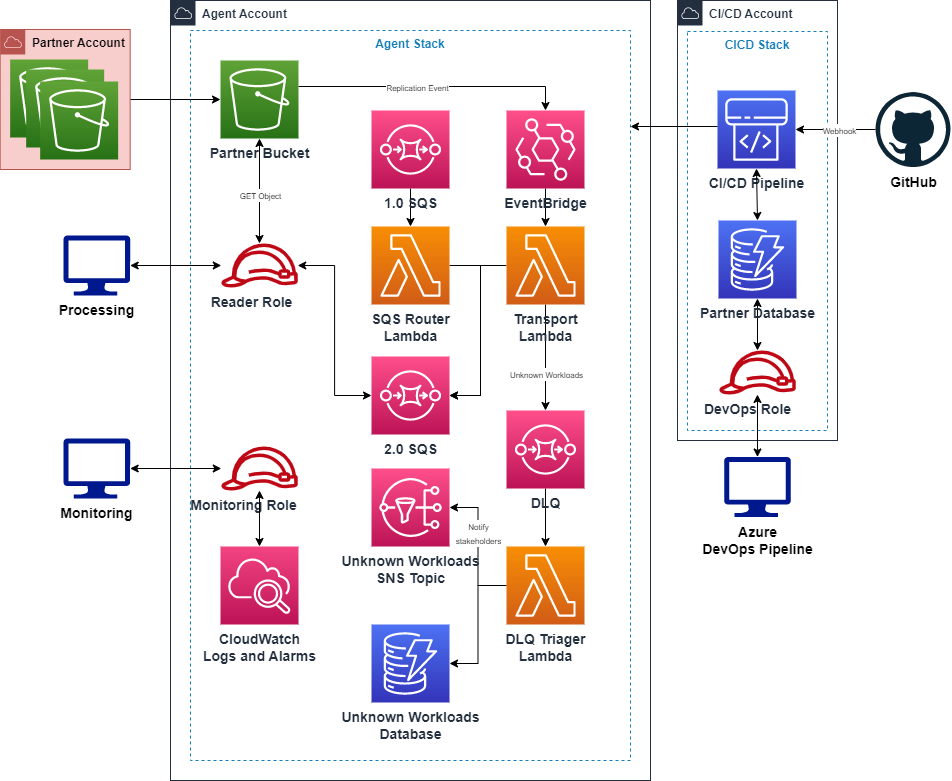

# CBS AWS Agent

- [CBS AWS Agent](#cbs-aws-agent)
  - [Copyright Notice](#copyright-notice)
  - [Description](#description)
    - [Supported Transport Log Types](#supported-transport-log-types)
  - [How it works](#how-it-works)
  - [Agent Management](#agent-management)
    - [Deployment](#deployment)
      - [Prerequisites](#prerequisites)
      - [Deploy steps](#deploy-steps)
    - [Removal](#removal)
    - [Development](#development)
      - [CI/CD Pipeline Development](#cicd-pipeline-development)
    - [Partner File](#partner-file)
    - [Deployment Context Guide](#deployment-context-guide)
    - [Testing](#testing)
  - [Cost](#cost)

## Copyright Notice

**FOR OFFICIAL USE AND AS PER NON-DISCLOSURE AGREEMENT**
All Rights Reserved. All information contained herein is, and remains the property of the Government of Canada.
No part of this source code or any supporting material may be reproduced or disseminated (including by
transmission, publication, modification, storage, or otherwise), in any form or any means, without the written
permission of the Communications Security Establishment, except in accordance with the provisions of the
Copyright Act. Applications for such permission shall be made to the Communications Security Establishment.

**Copyright registration number:** _1162524_

## Description

The agent is designed to work in conjunction with the [AWS Secure Environment Accelerator] (ASEA) or [Landing Zone Accelerator] (LZA) but is not limited to only its use. Replication rules are set up on the central logging buckets in the source organization and point to a destination account used for workload tagging and transport.

### Supported Transport Log Types

| Log Type            | Log Tag                                   |
| ------------------- | ----------------------------------------- |
| ASEA/LZA Metadata   | `aseaMetadata` \| `lzaMetadata`           |
| [CloudTrail Logs]   | `cloudtrailLogs`                          |
| CloudTrail Digest   | `cloudtrailDigest`                        |
| CloudWatch Logs     | `cloudwatchLogs`                          |
| Managed AD Logs     | `cloudwatch.managedADLogs`                |
| [NFW Logs]          | `cloudwatch.nfwLogs`                      |
| [RQL]               | `cloudwatch.rqlLogs`                      |
| [Security Hub Logs] | `cloudwatch.securityHubLogs`              |
| SSM Logs            | `cloudwatch.ssm`                          |
| [VPC Flow Logs]     | `cloudwatch.vpcFlowLogs` \| `vpcFlowLogs` |
| [Config Logs]       | `configLogs`                              |
| [GuardDuty Logs]    | `guardDutyLogs`                           |
| IAM Metadata        | `metadata.iam`                            |
| SSO Metadata        | `metadata.sso`                            |
| [ELB Logs]          | `elbLogsV2`                               |
| S3 Access Logs      | `s3AccessLogs`                            |
| SSM Inventory Logs  | `ssmInventory.*`                          |

## How it works



1. Log objects are created across the partner accounts and centralized to a log archive bucket by the ASEA/LZA.
2. The log archive buckets contain a replication rule that allows for replication to a bucket within the CCCS-owned account which matches the original bucket's encryption.
3. An S3 event is created on each log replication and is routed to the Transport Lambda via EventBridge.
4. The Lambda processes the event, tagging its workload and log creator, while discarding any unneeded files.
5. The event is tagged as is with the bucket path, workload and roles needed, then sent to an SQS.
6. The Reader user connects to the SQS for backhaul of data.

## Agent Management

### Deployment

#### Prerequisites

Depending on your [deployment context parameters](#deployment-context-guide) there will be different prerequisites involved. All deployments do require:

1. Python 3.11 [virtual environment](../cbs/cdk/README.md)
2. Setting your [deployment credentials]
3. Running `cdk bootstrap`

If you are deploying the CI/CD Pipeline Stack with the intent to deploy the agent in a separate account you will need to authenticate to that account and run the following command to set up permissions:

```bash
cdk bootstrap aws://<agent_account_id>/<region> \
  --trust <cicd_account_id> \
  --trust-for-lookup <cicd_account_id> \
  --cloudformation-execution-policies arn:aws:iam::aws:policy/AdministratorAccess
```

#### Deploy steps

1. Navigate to the `cbs/cdk/` folder.
2. Launch your [virtual environment for the cdk](../cbs/cdk/README.md).
3. Set your [deployment context parameters](#deployment-context-guide) for your deployment.
4. Run `cdk deploy`.

**Note:** If you are only deploying the agent you will need to create a file within the `cbs/cdk/` folder named `partner_inventory.json`. In this file populate it with the following, ensuring you replace `account-number` and `test-id` with your intended values.

```json
{
    "account-number": {"cbs-id": "test-id", "accelerator": "lza"}
}
```

### Removal

1. Ensure you are in an environment with the cdk installed and you have your credentials set for the account.
2. Run `cdk destroy MyStackName`.

**Note:** Depending on your environment, some resources may be unable to be deleted and may need manual intervention.

### Development

1. Pull down the repo from GitHub and start a new virtual environment on your system.
   1. For Linux-based systems: `python3 venv env && source env/bin/activate`.
2. In the virtual environment, run `pip install -r requirements-dev.txt`.
3. Run `pre-commit install` to install the git pre-commit hooks.
4. Fix all the bugs!

#### CI/CD Pipeline Development

When working on the CI/CD pipeline you have the option to use an S3 bucket for the CodePipeline source to reduce the need to create a Github PAT. To push code to this bucket and trigger the pipeline to navigate to the root folder of the repo, ensure you have valid credentials in the account and and run `python3 -m src.tools.zip_it -b <SourceBucketName>`. This script will use your environments AWS credentials to push the needed files to the S3 bucket. You may also add your bucket name to the script's default value under the `BUCKET_NAME` global variable.

### Partner File

If you are not using a DynamoDB table to store your partner info and want to deploy it with a custom set of partners for testing then create a file named `partner_inventory.json`. If partners aren't specified, a set of default values will be used, but replication will not occur within the created buckets.

The partner file must be located in the `cbs/cdk/` folder and be formatted as follows:

```json
{
  "account_id_0": {"cbs-id": "cbs_id_0", "accelerator": "lza"},
  "account_id_1": {"cbs-id": "cbs_id_1", "accelerator": "asea"}
}
```

### Deployment Context Guide

Deployment specific parameters are found in `cbs/cdk/config/`. Deployment using a specific config is done by the following command: `cdk deploy -c config=<environment>` where `<environment>` is one of (`dev` | `stage` | `prod`).

**Note** Parameters are set for the deployment when the initial `cdk deploy` of the stack is run and can be updated with continued `cdk deploy` steps only.

| Parameter              | Type         | Value Required | Description                                                                                                                                                                                                                                                                                             |
| ---------------------- | ------------ | -------------- | ------------------------------------------------------------------------------------------------------------------------------------------------------------------------------------------------------------------------------------------------------------------------------------------------------- |
| Environment            | string       | ✅              | Used to set tags and names; test, dev, stage and prod are the convention                                                                                                                                                                                                                                |
| AgentAccount           | string       | ❌              | The account ID of the account you want to deploy the CBS agent stack to                                                                                                                                                                                                                                 |
| OnlyAgent              | boolean      | ✅              | Whether to deploy just the CBS agent stack and not the CI/CD pipeline stack. This is to improve ease of development of the CBS agent stack                                                                                                                                                              |
| UsePAT                 | boolean      | ✅              | Whether to use a GitHub PAT token stored in a secret named github-token for a webhook trigger on the CI/CD CodePipeline. If `false`, will set up an S3 bucket to act as the pipeline's source; use `python -m src.tools.zip_it -b <codepipeline_source_bucket>` to push your changes to the environment |
| OpsGenieURL            | string       | ❌              | OpsGenie URL for CloudWatch Alarm's SNS topic subscription                                                                                                                                                                                                                                              |
| SQSArn                 | string       | ❌              | SQS ARN of 1.0 deployment of the agent to allow for routing/deduplication of messages                                                                                                                                                                                                                   |
| UnknownWorkloadsEmails | list[string] | ❌              | A list of emails to notify when a new unknown workload has been detected                                                                                                                                                                                                                                |
| UseRole                | boolean      | ✅              | `true` will allow you to deploy to your own AWS account without first setting up an IAM User. The role the IAM would normally use is also exposed to your account allowing you to perform similar actions to the user you are developing for                                                            |
| ImportUsersOrRoles     | boolean      | ✅              | `true` will attempt to import all roles or users specified in the role and user parameters. `false` will have stack attempt to create the specified roles or users and groups. If you input ARNs for the IAM values, it will attempt to import those resources regardless                               |
| DevOpsUser             | string       | ✅              | DevOps User for Azure DevOps. Either an ARN or username can be used. If only a name is given, it will be assumed that the resource lives in the deployment account. The Groups and the Users should be in the same account                                                                              |
| DevOpsGroup            | string       | ✅              | DevOps User Group for Azure DevOps. Either an ARN or group name can be used. If only a name is given, it will be assumed that the resource lives in the deployment account. The Groups and the Users should be in the same account                                                                      |
| ReaderUser             | string       | ✅              | Reader User for 4A. Either an ARN or username can be used. If only a name is given, it will be assumed that the resource lives in the deployment account. The Groups and the Users should be in the same account                                                                                        |
| ReaderUserGroup        | string       | ✅              | Reader User Group for 4A. Either an ARN or group name can be used. If only a name is given, it will be assumed that the resource lives in the deployment account. The Groups and the Users should be in the same account                                                                                |
| GrafanaUser            | string       | ✅              | Grafana User for monitoring. Either an ARN or username can be used. If only a name is given, it will be assumed that the resource lives in the deployment account. The Groups and the Users should be in the same account                                                                               |
| GrafanaUserGroup       | string       | ✅              | Grafana User Group for monitoring. Either an ARN or group name can be used. If only a name is given, it will be assumed that the resource lives in the deployment account. The Groups and the Users should be in the same account                                                                       |

### Testing

To run unit tests across our modules from the root directory run `pytest`

## Cost

The agent costs are variable depending on workload size, but per month the resources we use add up to approximately:

- Lambda ~ $1/month
- KMS ~ $30-50/month
- CloudWatch ~ $1/month
- CodePipeline ~ $1/month
- SNS ~ $1/month
- S3 ~ $0.10/month

**Total:** ~ $35-100/month for our resources

[aws secure environment accelerator]: https://github.com/aws-samples/aws-secure-environment-accelerator
[landing zone accelerator]: https://github.com/awslabs/landing-zone-accelerator-on-aws
[rql]: https://docs.aws.amazon.com/Route53/latest/DeveloperGuide/resolver-query-logs.html
[cloudtrail logs]: https://docs.aws.amazon.com/awscloudtrail/latest/userguide/cloudtrail-user-guide.html
[nfw logs]: https://docs.aws.amazon.com/network-firewall/latest/developerguide/logging-monitoring.html
[security hub logs]: https://docs.aws.amazon.com/securityhub/latest/userguide/what-is-securityhub.html
[config logs]: https://docs.aws.amazon.com/config/latest/developerguide/security-logging-and-monitoring.html
[elb logs]: https://docs.aws.amazon.com/elasticloadbalancing/latest/application/load-balancer-access-logs.html
[guardduty logs]: https://docs.aws.amazon.com/guardduty/latest/ug/what-is-guardduty.html
[vpc flow logs]: https://docs.aws.amazon.com/vpc/latest/userguide/flow-logs.html
[deployment credentials]: https://docs.aws.amazon.com/cdk/v2/guide/getting_started.html#getting_started_prerequisites
